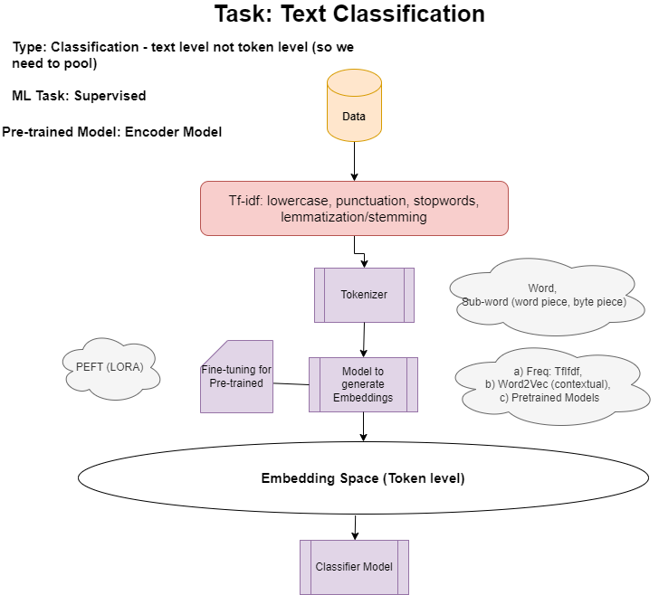

# Finetuning BERT using LORA technique for Text Classification
- Baseline: we classify spam using simple TfIdf features. The F1-score is impressive at 0.99
- Impact of Finetuning: we fine-tune BERT using LoRA to get embeddings and improve on this F1-score.

## High level design of the solution

## LORA finetuning
- LoRA (Low-Rank Adaptation) fine-tuning is a technique used to adapt pre-trained language models to specific tasks.
- Instead of updating all model parameters during fine-tuning, LoRA inserts trainable low-rank matrices into each layer of the model. 
- This allows learning task-specific changes while keeping all other model parameter frozen. 
- Advantage: reduces the number of trainable parameters but achieves competitive performance.

## Results:
- LORA finetuned BERT model's F1 score: 0.9919
- Last layer finetuned BERT model's F1 score: 0989
- tf-idf based linear SVM model's f1 score: 0.99

- Without fine-tuning, BERT based model is unable to beat performance of tf-idf based solution. After fine-tuning, it is able to beat tf-idf based svm model.